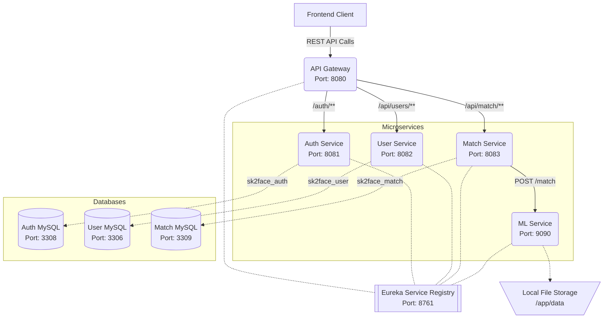

# SK2Face Backend Architecture

This document describes the high-level architecture of the SK2Face backend systems, including the API Gateway, microservices, and databases.

## System Architecture Diagram



### Architecture Details

1. **API Gateway (Spring Cloud Gateway)**: Acts as the single entry point for all client requests. It proxies requests to the appropriate microservices based on the URL path (`/auth/**`, `/api/users/**`, `/api/match/**`). It also handles CORS configurations and interacts with the Auth Service for token validation on protected routes.
2. **Service Registry (Netflix Eureka)**: All microservices (including the Python-based ML service) register themselves with the Eureka server to enable dynamic service discovery.
3. **Auth Service (Spring Boot)**: Handles user registration, login, JWT token issuance, and validation. Has its own MySQL database for credentials.
4. **User Service (Spring Boot)**: Manages detailed user profiles. Has its own MySQL database.
5. **Match Service (Spring Boot)**: Manages the business logic for facial matching requests, maintaining match history. It delegates the actual machine learning inferences to the ML Service. Has its own MySQL database.
6. **ML Service (FastAPI)**: A synchronous AI service that accepts an image path, computes embeddings, and returns the top 3 matches using a pre-loaded local database of images.
# SK2Face API Documentation

This document provides complete details for all backend API endpoints available through the **API Gateway** running on `http://localhost:8080`.

**Note:** All requests from the frontend should be directed to the API Gateway on port `8080`, not directly to the individual microservices.

---

## 1. Authentication Service &zwnj;(`/auth/**`)

All endpoints under `/auth/` are open and do not require a JWT token, except for `/auth/logout`.

### 1.1 `POST /auth/register`
Creates a new user account.

**Request Body** (`application/json`):
```json
{
  "username": "johndoe",
  "password": "SecurePassword123!",
  "employeeId": "EMP001",
  "fullName": "John Doe",
  "officialEmail": "johndoe@sk2face.com",
  "designation": "Software Engineer",
  "departmentName": "Engineering",
  "phoneNumber": "1234567890"
}
```

**Responses**:
* `201 Created`: Registration successful.
```json
{
  "status": "SUCCESS",
  "message": "Registered successfully",
  "data": {
    "userUuid": "550e8400-e29b-41d4-a716-446655440000",
    "username": "johndoe"
  },
  "timestamp": "2026-02-27T10:00:00",
  "traceId": "abcdef12"
}
```

### 1.2 `POST /auth/login`
Authenticates a user and returns JWT access and refresh tokens.

**Request Body** (`application/json`):
```json
{
  "username": "johndoe",
  "password": "SecurePassword123!"
}
```

**Responses**:
* `200 OK`: Login successful.
```json
{
  "status": "SUCCESS",
  "data": {
    "accessToken": "eyJh... (JWT string)",
    "accessTokenExpiresAt": 1700000000000,
    "refreshToken": "550e8400-e29b...",
    "userUuid": "550e8400-e29b-41d4-a716-446655440000"
  },
  "timestamp": "2026-02-27T10:00:00",
  "traceId": "abcdef12"
}
```

### 1.3 `POST /auth/refresh`
Generates a new access token using a valid refresh token.

**Request Body** (`application/json`):
```json
{
  "refreshToken": "550e8400-e29b-..."
}
```

**Responses**:
* `200 OK`: Token refreshed successfully. Same response schema as Login.

### 1.4 `POST /auth/logout`
Logs out the user by blacklisting the active JWT token.

**Headers Required**:
* `Authorization: Bearer <access_token>`

**Responses**:
* `200 OK`: Logged out successfully.
```json
{
  "status": "SUCCESS",
  "message": "Logged out",
  "data": null,
  "timestamp": "...",
  "traceId": "..."
}
```

---

## 2. User Service &zwnj;(`/api/users/**`)

All endpoints under `/api/users/` are protected and require a valid JWT token. The API gateway automatically maps the `Authorization` header to an internal user identity.

**Headers Required**:
* `Authorization: Bearer <access_token>`

### 2.1 `GET /api/users`
Retrieve a paginated list of users.

**Query Parameters (Optional)**:
* `page` (default: 0)
* `size` (default: 10)

**Responses**:
* `200 OK`: Returns a paginated object containing [UserResponse](file:///home/badam/Downloads/mini_project2/sk2face-backend/user-service/src/main/java/com/sk2face/userservice/dto/UserResponse.java#6-17) details.

### 2.2 `POST /api/users`
Create a user profile (Typically used internally, but available).

**Request Body** (`application/json`):
```json
{
  "userId": 123,
  "employeeId": "EMP001",
  "fullName": "John Doe",
  "officialEmail": "johndoe@sk2face.com",
  "designation": "Software Engineer",
  "departmentName": "Engineering",
  "phoneNumber": "1234567890"
}
```

**Responses**:
* `201 Created`: Returns the created [UserResponse](file:///home/badam/Downloads/mini_project2/sk2face-backend/user-service/src/main/java/com/sk2face/userservice/dto/UserResponse.java#6-17).

### 2.3 `GET /api/users/{id}`
Retrieve a specific user profile by user ID.

**Path Variables**:
* [id](file:///home/badam/Downloads/mini_project2/sk2face-backend/auth-service/src/main/java/com/sk2face/authservice/controller/AuthController.java#72-110): The User ID.

**Responses**:
* `200 OK`: Returns the [UserResponse](file:///home/badam/Downloads/mini_project2/sk2face-backend/user-service/src/main/java/com/sk2face/userservice/dto/UserResponse.java#6-17) object.
```json
{
  "status": "SUCCESS",
  "data": {
    "userId": "123",
    "employeeId": "EMP001",
    "fullName": "John Doe",
    "designation": "Software Engineer",
    "departmentName": "Engineering",
    "officialEmail": "johndoe@sk2face.com",
    "phoneNumber": "1234567890"
  },
  "timestamp": "...",
  "traceId": "..."
}
```

### 2.4 `PUT /api/users/{id}`
Update an existing user profile.

**Path Variables**:
* [id](file:///home/badam/Downloads/mini_project2/sk2face-backend/auth-service/src/main/java/com/sk2face/authservice/controller/AuthController.java#72-110): The User ID.

**Request Body** (`application/json`): Same schema as creation representing fields to update.

**Responses**:
* `200 OK`: Returns the updated [UserResponse](file:///home/badam/Downloads/mini_project2/sk2face-backend/user-service/src/main/java/com/sk2face/userservice/dto/UserResponse.java#6-17).

### 2.5 `DELETE /api/users/{id}`
Deactivates a user account.

**Path Variables**:
* [id](file:///home/badam/Downloads/mini_project2/sk2face-backend/auth-service/src/main/java/com/sk2face/authservice/controller/AuthController.java#72-110): The User ID.

**Responses**:
* `204 No Content`: Successful deactivation.

---

## 3. Match Service &zwnj;(`/api/match/**`)

All endpoints under `/api/match/` are protected and require a valid JWT token.

**Headers Required**:
* `Authorization: Bearer <access_token>`

### 3.1 `POST /api/match`
Submit an image file to find the top matching faces.

**Request Body** (`multipart/form-data`):
* `image` (File): The image file to be matched against the database.

**Responses**:
* `200 OK`: Match completed successfully.
```json
{
  "status": "SUCCESS",
  "data": {
    "match1": "http://localhost:9090/static/photos/img1.jpg",
    "match2": "http://localhost:9090/static/photos/img2.jpg",
    "match3": "http://localhost:9090/static/photos/img3.jpg"
  },
  "timestamp": "...",
  "traceId": "..."
}
```

### 3.2 `GET /api/match/history`
Retrieve a paginated historical list of match requests for the currently authenticated user.

**Query Parameters (Optional)**:
* `page` (default: 0)
* `size` (default: 10)

**Responses**:
* `200 OK`: Returns paginated match history data.
```json
{
  "status": "SUCCESS",
  "data": {
    "content": [
      {
        "id": 1,
        "inputImageUrl": "/app/data/photos/m1-004-01.jpg",
        "match1": "http://localhost:9090/static/photos/img1.jpg",
        "match2": "http://localhost:9090/static/photos/img2.jpg",
        "match3": "http://localhost:9090/static/photos/img3.jpg",
        "status": "COMPLETED",
        "createdAt": "2026-02-27T10:05:00"
      }
    ],
    "pageable": { ... },
    "totalElements": 1,
    "totalPages": 1
  },
  "timestamp": "...",
  "traceId": "..."
}
```